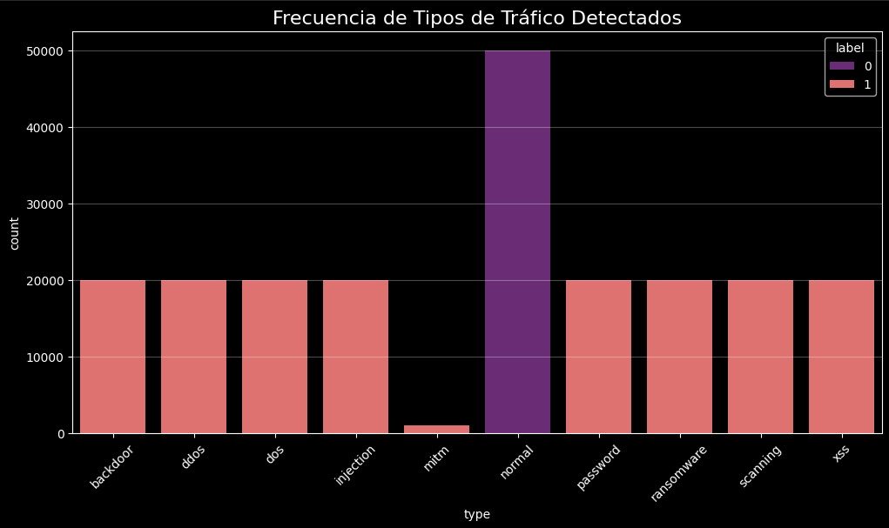
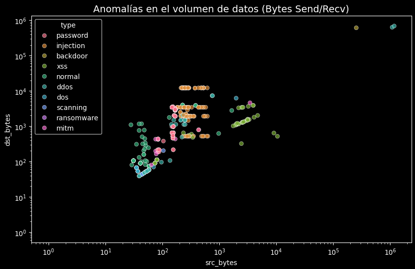
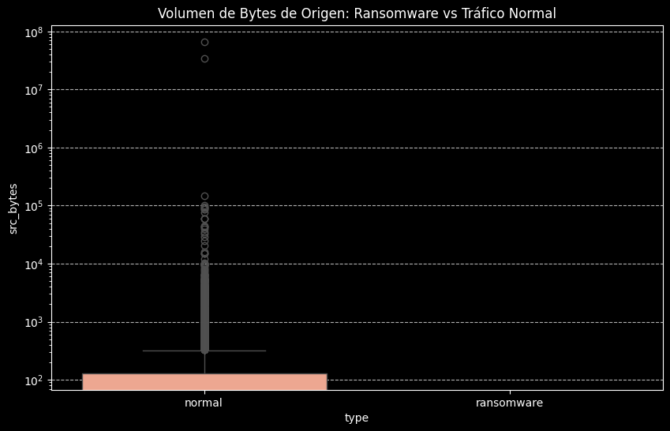
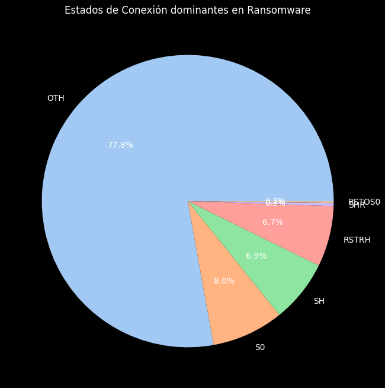
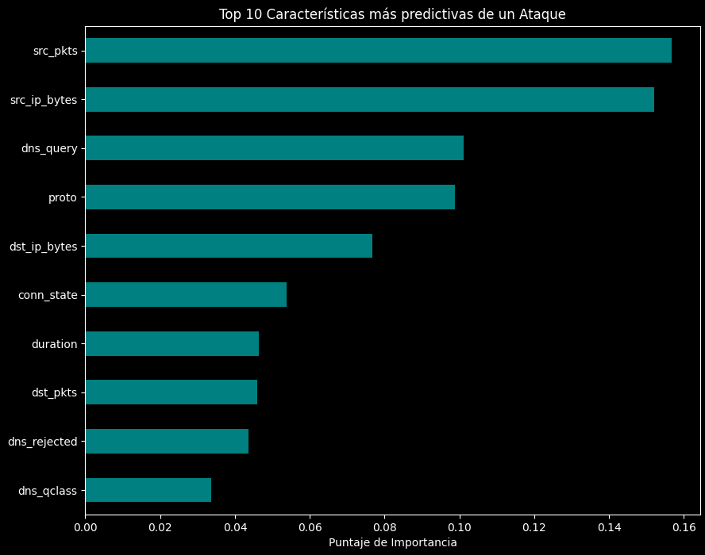
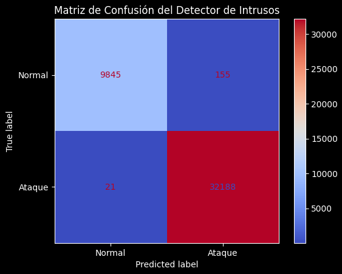

  

<h1 align="center">Laboratorio 3 - Grupo 6</h1>

  <b>MCIB-B</b> 
  Trabajo grupal enfocado en el tratamiento de datos, análisis exploratorio de datos(EDA) y visualización de datos.

<h2>Integrantes</h2>

<ul>
  <li>AMAGUA OSCAR</li>
  <li>OJEDA ALAN</li>
  <li>SUNTAXI DIEGO</li>
</ul>

<h2>Introducción</h2>

En el presente proyecto se desarrolla un análisis de datos a partir de un conjunto obtenido de Kaggle, el cual se enfoca en el estudio del tráfico generado en entornos de dispositivos interconectados. Este tipo de información resulta especialmente relevante en la actualidad debido al crecimiento de ecosistemas digitales donde múltiples dispositivos intercambian datos de manera constante, generando grandes volúmenes de información susceptibles de análisis.

El dataset seleccionado contiene registros estructurados de actividad en red, incluyendo características relacionadas con flujos de comunicación, protocolos y métricas de transmisión. Además, incorpora tanto comportamientos normales como eventos asociados a actividades maliciosas, lo que permite abordar problemas de clasificación y detección de anomalías en contextos reales. En particular, este tipo de datos es ampliamente utilizado en el desarrollo de sistemas de detección de intrusos y modelos de ciberseguridad basados en aprendizaje automático .

A partir de este conjunto de datos, se llevó a cabo un proceso de preparación que incluyó la limpieza, transformación y adecuación de las variables, asegurando la consistencia y calidad necesarias para el análisis. Posteriormente, se realizó un Análisis Exploratorio de Datos (EDA) con el objetivo de identificar patrones de comportamiento, distribuciones relevantes y posibles irregularidades dentro del tráfico analizado.

Como complemento, se desarrollaron visualizaciones que permiten interpretar de forma clara las dinámicas presentes en los datos, facilitando la identificación de tendencias y relaciones entre variables. Finalmente, todo el proceso fue documentado en un repositorio de GitHub, donde se detallan los pasos realizados, los principales hallazgos y las conclusiones obtenidas.

Este proyecto no solo busca aplicar técnicas de análisis de datos, sino también comprender cómo la información generada en entornos de red puede ser utilizada para identificar comportamientos anómalos y contribuir al desarrollo de soluciones en el ámbito de la ciberseguridad.

<h2>Objetivo</h2>

Analizar y procesar datos de tráfico de red en entornos IoT para identificar patrones de comunicación, diferenciar comportamientos normales de anómalos y generar insights que contribuyan a la comprensión y detección de posibles amenazas en sistemas interconectados.

<h2>Parte 1 – Desarrollo</h2>

<h3>Selección del dataset - ToN_IoT Dataset</h3>
<ul>
  <li>URL: https://www.kaggle.com/datasets/amineipad/ioittt</li>
  <li>Dataset de telemetría de red orientado a la detección de amenazas en entornos IoT.</li>
  <li>Incluye tráfico benigno y múltiples tipos de ataques como DDoS, Backdoors, Inyección y Ransomware.</li>
</ul>

El dataset ToN_IoT es ampliamente utilizado en investigación académica en ciberseguridad, ya que simula escenarios reales de ataque en infraestructuras híbridas (Cloud, Edge y redes locales). Su principal utilidad es el entrenamiento y validación de sistemas de detección de intrusos (IDS).

<h3>Procesamiento de datos</h3>

Para garantizar la calidad del análisis, se realizó un proceso de limpieza y transformación de los datos enfocado en evitar sesgos y mejorar la capacidad analítica:

<ul>
  <li>Transformación de valores inválidos ("-") a valores nulos y posterior imputación.</li>
  <li>Eliminación de variables irrelevantes como direcciones IP y puertos para evitar overfitting.</li>
  <li>Codificación de variables categóricas como protocolos y estados de conexión.</li>
  <li>Preparación del dataset para análisis exploratorio y modelado.</li>
</ul>

<h3>Análisis Exploratorio de Datos (EDA)</h3>

El análisis exploratorio permitió identificar patrones clave en el comportamiento del tráfico de red, diferenciando claramente entre tráfico benigno y actividades maliciosas.

<ul>
  <li>Distribución de diferentes tipos de ataques en el dataset.</li>
  <li>Identificación de patrones específicos de ataques como Ransomware.</li>
  <li>Análisis de volumen de datos transmitidos y duración de conexiones.</li>
  <li>Detección de anomalías en el tráfico de red.</li>
</ul>

<h3>Visualización de datos</h3>

Se generaron visualizaciones que permiten interpretar de forma clara los patrones identificados:

<ul>
  <li>Distribución de ataques (gráfico de barras).</li>
  <li>Comparación de volumen de datos entre tráfico normal y malicioso (boxplot).</li>
  <li>Análisis de estados de conexión en ataques específicos.</li>
  <li>Detección de anomalías mediante gráficos de dispersión.</li>
</ul>

<h3>Principales hallazgos</h3>

<ul>
  <li>El tráfico malicioso presenta patrones claramente diferenciables respecto al tráfico benigno.</li>
  <li>El Ransomware se caracteriza por conexiones persistentes en protocolo TCP.</li>
  <li>Se detectó un aumento significativo en el volumen de datos enviados en ataques de exfiltración.</li>
  <li>Los ataques generan comportamientos anómalos visibles en la relación entre datos enviados y recibidos.</li>
</ul>

<h3>Modelo de Machine Learning</h3>

Como valor agregado, se implementó un modelo de clasificación basado en Random Forest para la detección de amenazas.

<ul>
  <li>Separación del dataset: 80% entrenamiento, 20% prueba.</li>
  <li>Entrenamiento del modelo con variables relevantes del tráfico.</li>
  <li>Evaluación mediante matriz de confusión.</li>
</ul>

El modelo permitió identificar ataques con un alto nivel de precisión, demostrando el potencial del uso de Machine Learning en sistemas IDS.

<h3>Análisis visual de resultados</h3>

A continuación se presentan los principales resultados obtenidos a partir del análisis exploratorio de datos, acompañados de su interpretación.

<h3>Interpretación de Resultados</h3>

<h4>1. Distribución de tipos de tráfico</h4>

  

El dataset presenta una distribución equilibrada entre tráfico normal y diferentes tipos de ataques, lo que permite entrenar modelos robustos capaces de detectar múltiples amenazas sin sesgos hacia una sola clase.

<h4>2. Anomalías en el volumen de datos</h4>

  

Se observan clústeres claramente diferenciados entre tráfico normal y malicioso, donde los ataques se concentran en regiones de alto volumen de datos, confirmando que el análisis de bytes es un indicador clave para detectar anomalías.

<h4>3. Ransomware vs Tráfico Normal</h4>

  

El ransomware presenta valores significativamente más altos de datos enviados, evidenciando comportamientos asociados a exfiltración de información o comunicación con servidores externos.

<h4>4. Estados de conexión en Ransomware</h4>

  

El predominio del estado OTH indica que los ataques utilizan conexiones no convencionales, lo cual es característico de tráfico malicioso que intenta evadir mecanismos de detección tradicionales.

<h4>5. Importancia de variables</h4>

  

El análisis de importancia de variables evidencia que los atributos más influyentes en la detección de ataques están directamente relacionados con el comportamiento del tráfico de red, destacando <b>src_pkts</b>, <b>src_ip_bytes</b> y <b>dns_query</b>.

Esto demuestra que los ataques pueden ser identificados a partir de patrones de volumen de datos, frecuencia de paquetes y actividad de red, sin depender de información estática como direcciones IP.

Desde una perspectiva de ciberseguridad, este resultado es especialmente relevante, ya que permite diseñar sistemas de detección de intrusos (IDS) más eficientes, utilizando un conjunto reducido de variables clave. Esto facilita su implementación en entornos IoT y dispositivos de borde (Edge), donde los recursos computacionales son limitados.

Adicionalmente, estos hallazgos permiten establecer mecanismos de mitigación, como la creación de reglas de firewall dinámas que identifiquen y bloqueen flujos de tráfico que excedan los umbrales normales de volumen y comportamiento, mejorando la detección temprana de amenazas como ransomware.

<h4>6. Evaluación del modelo</h4>

  

El modelo presenta alta precisión con mínimos errores de clasificación, demostrando su efectividad para detectar ataques y su aplicabilidad en sistemas reales de detección de intrusos.

<h3>Conclusión Analítica</h3>

El análisis realizado demuestra que el tráfico malicioso en entornos IoT presenta patrones claramente diferenciables en términos de volumen, comportamiento de conexión y uso de protocolos.

Las variables relacionadas con el volumen de datos y la duración de las conexiones son los indicadores más relevantes para la detección de amenazas, lo que permite diseñar sistemas de seguridad eficientes incluso en dispositivos con recursos limitados.

Finalmente, la implementación de modelos de Machine Learning como Random Forest confirma que es posible automatizar la detección de intrusiones con alta precisión, contribuyendo al desarrollo de soluciones de ciberseguridad modernas y escalables.

<h3>Comentario</h3>

El desarrollo del análisis permitió comprender la importancia del tratamiento de datos en entornos de ciberseguridad. La combinación de técnicas de limpieza, análisis exploratorio y visualización permitió identificar patrones relevantes y comportamientos anómalos en el tráfico IoT.

Adicionalmente, la implementación de un modelo de Machine Learning demuestra cómo estos análisis pueden ser llevados a sistemas reales de detección de intrusiones, optimizando la seguridad en infraestructuras modernas.

<h3>Impacto en entornos reales</h3>

Los resultados obtenidos en este análisis demuestran que es posible implementar sistemas de detección de intrusos eficientes utilizando un conjunto reducido de variables clave, lo que facilita su despliegue en entornos IoT y arquitecturas de Edge Computing.

Esto permite detectar amenazas en tiempo real sin necesidad de infraestructuras complejas, optimizando recursos y mejorando la seguridad en dispositivos interconectados.

En un contexto empresarial, este enfoque puede aplicarse para proteger infraestructuras críticas, prevenir ataques como ransomware y reducir el impacto operativo de incidentes de ciberseguridad.

<h2>Conclusiones</h2>

<ul>
  <li>El análisis de tráfico IoT permite identificar patrones clave en la detección de amenazas.</li>
  <li>El volumen de datos y la duración de las conexiones son indicadores críticos en ataques como Ransomware.</li>
  <li>Los modelos de Machine Learning pueden mejorar significativamente la detección de intrusiones.</li>
  <li>Es posible implementar soluciones ligeras de seguridad basadas en variables clave en entornos Edge.</li>
  <li>El uso de herramientas de análisis de datos facilita la toma de decisiones en ciberseguridad.</li>
</ul>

